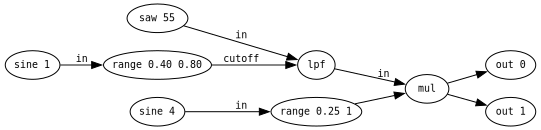
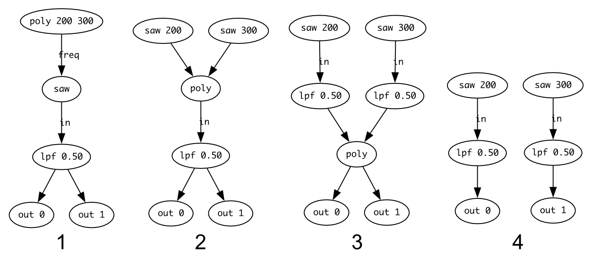
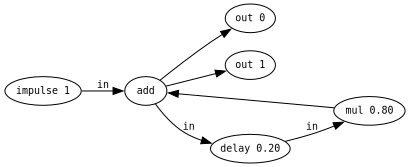

---
# This template is licensed under a Creative Commons 0 1.0 Universal License (CC0 1.0). Public Domain Dedication.

title: 'KabelSalat: Live Coding Audio-Visual Graphs on the Web and Beyond'
author:
  - name: Felix Roos
    affiliation: Unaffiliated
    email: flix91@gmail.com
  - name: Raphaël Maurice Forment
    affiliation: Université Jean Monnet
    email: raphael.forment@gmail.com
abstract: |
  This paper introduces KabelSalat, a graph-based live coding environment that targets multiple platforms and languages. It works by translating a Domain Specific Language (DSL) based on JavaScript into a signal flow graph. This graph can be compiled into a sequence of instructions optimized for real time signal processing. The compiler can either output JavaScript code to run in the browser or optimized C code to run natively. The possibility of adding other target languages is an integral part of KabelSalat's design. The browser version includes a REPL and features a range of audio DSP nodes reminiscent of modular synthesizers. Notable features include single sample feedback and multi-channel expansion inspired by the SuperCollider audio engine. The core module of KabelSalat has also been used to implement a stripped down version of the Hydra video synthesizer, thus demonstrating that the same underlying principles can be adapted both to audio and video processing. In the future, KabelSalat might become an alternative audio engine for Strudel, offering more sound design capabilities, compared to the current SuperDough engine, which uses the browser's built-in Web Audio graph.
fontsize: 11pt
geometry: margin=2cm
fontfamily: libertine
fontfamily: inconsolata
mainfont: Linux Libertine
monofont: Inconsolata
bibliography: references.bib
header-includes:
    - \usepackage{svg}
...

# Introduction

Graphs are often used to represent the signal flow of live coding systems, as illustrated by Glicol [@glicol], Trane [@trane], Genish.js [@Roberts17], Hydra [@hydra;@jack2019] or Punctual [@punctual].
In the broader sphere of creative software applications, the graph abstraction is a popular choice for signal flow driven applications in the audio-visual domain.
Some examples are NoiseCraft [@noisecraft] for audio synthesis or cables.gl [@cables] for visual creative coding.
Graphs are sometimes perceived as more natural to the end user.
They allow a direct and spatial representation of the data flow, sometimes emulating the patching of pedalboards or modular synthesizers.
Many important audio programming languages from the past decades, such as Pure Data [@puredata] and SuperCollider [@supercollider] are also computing audio based on the concept of signal flow graphs. From the perspective of a software developer, graphs often allow for an optimized execution of the signal processing chain, as they can be analyzed and optimized before execution.

Audio signal processing in web browsers has historically adopted a graph based approach which is reflected by the ubiquitous Web Audio API^[The _Mozilla Developer Network_ (MDN) website provides a thorough introduction to the Web Audio API: [https://developer.mozilla.org/en-US/docs/Web/API/Web_Audio_API/Using_Web_Audio_API](https://developer.mozilla.org/en-US/docs/Web/API/Web_Audio_API/Using_Web_Audio_API) (accessed on September 27, 2024).
This API can be considered as the general framework for building more complex applications and libraries such as ToneJS [@tonejs].].
The Web Audio API is based on a classic block-based processing model [@cmtutorial] and relies on a set of predefined audio nodes comparable to UGens^[_UGens_ (_unit generators_) is a term used to describe the fundamental blocks for generating or processing signals in a computer music language (_e.g._ an oscillator, a filter, etc). The name is a direct heritage from the _MUSIC-N_ family of languages, nowadays represented by _CSound_.] in computer music programming languages.
These nodes were initially designed for lightweight multimedia applications rather than specialized audio and signal processing (_e.g._ basic audio filters, equalization, panning).
In other domains, time and CPU usage can prove to be a critical resource.
For the creative musicians, such nodes can be limiting, as they do not allow for the creation of complex audio graphs or the implementation of optimized and lightweight specialized audio algorithms.
The introduction of AudioWorklets has recently opened up the possibility of performant single-sample processing in the browser [@Choi2018AudioworkletTF].
They also offer a way for developers to build bespoke audio nodes.

AudioWorklets are offering significant advantages over block-based processing.
Single-sample processing removes the block size constraint of classic Web Audio nodes, which is often felt as both a technical and creative limitation.
Computing audio in blocks can hinder the implementation of various classic algorithms: filter design, physical modeling, etc.
Consequently, this can have an incidence on the sonic palette available to the musician.
Despite their recent introduction, AudioWorklets have already proven their value in the implementation of audio feedback loops, granular synthesis algorithms [@Roberts17;@Roberts18] or physical modeling [@karplus].
AudioWorklets are offering yet another advantage: they are self-contained signal processors that do not depend on web platform specifics.
This enables developers to write systems that can be ported from and to the web with relative ease.

We began exploring the new avenues introduced by AudioWorklets because of technical and creative constraints felt during the development of Strudel [@strudel]. Strudel's audio engine, called SuperDough, is implemented using the aforementioned Web Audio API. It has been designed in imitation of SuperDirt, the classic Tidal Cycles audio engine. However, unlike SuperDough, SuperDirt relies on the extensive capabilities of the SuperCollider audio server. It appeared difficult, in practice, to achieve the same level of precision and flexibility with the tools we had at our disposal. In order to provide users with a similar level of expressiveness in audio synthesis, we needed to find a way to implement high performant custom nodes in the browser. On the basis of the work done on KabelSalat, our long-term goal is to be able to rewrite Strudel's current audio engine using a flexible and portable solution running inside a single AudioWorklet. For the time being, Strudel still relies on the more limited set of features provided by the Web Audio API graph.

, accessed on September 27, 2024) running a Karplus Strong patch. On the left pane pane: source code editor with in-source widgets. On the right pane: the real-time audio graph visualizer.](images/repl2.png)

# Introducing KabelSalat

KabelSalat implements a Domain Specific Language (DSL) to represent and compile graphs suitable for single-sample processing. It can be used both as a prototyping bench for audio algorithms or as a DSP-oriented live coding language. The project is split into several packages, allowing KabelSalat to be embedded in other applications. It can also be used as a standalone application through the online REPL (Read Evaluate Print Loop, see Figure 1). The development of KabelSalat started as an experiment, trying to use the browser-based NoiseCraft synthesizer [@noisecraft] as an audio backend for a newly developed JavaScript DSL. Instead of relying on the graphical node patching interface of NoiseCraft, the DSL was developed to be able to express similar graphs textually. Since then, NoiseCraft's code has been altered and extended in many ways. One example being its compiler, which has been reimplemented to be agnostic to its output language. With this addition, graphs can be compiled to multiple languages without changing the logic of the compiler. To test the viability of this design, we have developed a way for KabelSalat patches to be compiled to C code and played back as standalone binaries. As another proof-of-concept, KabelSalat was used to compile Hydra patches to GLSL code^[Link to _hydro_ repository on Github: [https://github.com/felixroos/hydro](https://github.com/felixroos/hydro) (_idem_). This experiment, closely related to KabelSalat, aims to re-implement Hydra in a self-contained HTML file including its own code editor and REPL.], showing an application of the same concepts in another neighbouring domain.

## First example: a subtractive synthesizer patch

KabelSalat is based on a terse syntax that relies heavily on method chaining. It is directly inspired by the syntax of Hydra [@hydra] and Strudel [@strudel]^[Strudel used the same technique applied to a different domain: the functional composition of musical patterns. Hydra uses it, similarly to KabelSalat, as a way to connect and combine video processing nodes.].
Chaining methods can be seen as a way to emulate the patch point connections between the different modules of a synthesizer. Both functions and methods can be considered as signal generators or processors (nodes), which can be connected to other modules through chaining or reference. Arguments of these nodes can either be constant values or other nodes. The same basic principles can be used for creating patches of arbitrary depth and complexity. The following code example shows how a classic subtractive synthesizer patch can be written in KabelSalat. Figure 2 is the visual representation of the same audio graph, which has been automatically generated in the KabelSalat REPL.



```js
// sawtooth wave at 55Hz:
saw(55)
  // modulated low-pass-filter
  .lpf(sine(1).range(0.4, 0.8))
  // modulated amplitude:
  .mul(sine(4).range(0.25, 1))
  // send to audio output:
  .out();
```

## Multichannel Expansion

KabelSalat borrows the concept of multichannel expansion from SuperCollider^[This feature is documented in the official SuperCollider documentation: [https://doc.sccode.org/Guides/Multichannel-Expansion.html](https://doc.sccode.org/Guides/Multichannel-Expansion.html) (accessed on September 28, 2024).], allowing the duplication of a node or a chain of nodes to multiple channels. Large audio graphs involving parallel processing can thus be generated with relatively few characters. Multichannel expansion is used by providing function/method arguments as Arrays (_e.g._ `[1, 2, 3, 4]`).

```js
// creating two channels of filtered sawtooth waves
saw([200, 300]).lpf(0.5).out([0, 1]);
```

Multichannel expansion in KabelSalat involves the use of a special `poly` node.
Array arguments are converted to `poly` nodes automatically, where each Array element becomes an input.
When a node receives a `poly` node with `n` inputs, `n` copies of the node are created. Each copy receives one of the values in the Array.
The copied nodes are fed into a new `poly` node, which is propagated down the graph.
The `poly` node will eventually end up at the bottom of the graph, where each channel is assigned to one `out` node.
In cases where a node receives multiple `poly` nodes, the `poly` node with the most inputs determines the number of copies.
The inputs of the other `poly` nodes wrap around.
Figure 3 shows a graphical version of how the `poly` node is propagated in the above example.



\newpage

## Feedback

Feedback loops play an important role in digital audio synthesis, allowing the creation of comb filters, feedback delay networks (FDN), reverbs, flanger effects, among many other applications [@juliusfeedback;@Roberts17].
Feedback is also an important technique in the realm of video synthesis^[See for instance: [https://andreijaycreativecoding.com/getting_started-with-video-feedback](https://andreijaycreativecoding.com/getting_started-with-video-feedback) (accessed September 28, 2024).
Feedback loops are also a popular feature of the well-known Hydra video synthesizer used by many live coders: [https://hydra.ojack.xyz/docs/](https://hydra.ojack.xyz/docs/) (_idem_)].
A feedback loop is created in a graph when a node uses its own output as an input.
KabelSalat supports two techniques to create such loops: through the usage of anonymous functions or through a special source (`src`) node.
Choosing the appropriate technique depends both on the context and on user's preference.

### Feedback loop using anonymous functions

Passing an anonymous function to a node can be used to create a feedback cycle. In the following example, the `add` node receives an anonymous function as its input. To close the feedback cycle, the anonymous function receives its own output as an argument. Any alteration or further processing done to the feedback line can be notated inside the function (_e.g._ amplitude modulation, introducing a delay). Figure 4 illustrates the representation of a feedback loop in the graph visualizer.

```js
impulse(1)
  .add((x) => x.delay(0.2).mul(0.8))
  .out();
```

### Feedback loop using the source (`src`) Node

Feedback can also be created using the dedicated source (`src`) node (Figure 4). This syntax is inspired by Hydra [@hydra], where feedback is created by declaring `src` and `out` nodes with matching arguments. This notation will not create a cycle in the graph. Instead, the `src` node references the corresponding output register, which contains the output of the previous sample. The concept of output registers will be examined in more detail in section 3.

```js
impulse(1).add(src(0).delay(0.1).mul(0.8)).out();
```



\newpage

# Audio Graph Compilation

KabelSalat graphs are compiled into a representation optimized to run efficiently given the constraints of a real-time system.
For the sake of demonstration, we are going to focus on the JavaScript output^[Similar principles apply to the C or the GLSL compilation targets.].
Given the enhancements of JavaScript runtimes over the recent years [@v8], the language has become a viable target for audio DSP.

## First step: from DSL to Graph

In the KabelSalat DSL, each expression starts with a function call that represents a source node.
Such a function call returns an instance of `Node`, which contains a method for each node type.
Methods internally call the function of the same name, passing the `Node` they are called on as the first argument.
This means that each expression using method chaining has an equivalent variant with function calls only. For example, `saw(200).lpf(.5).out()` is equivalent to `out(lpf(saw(200), 0.5))`. As a TypeScript interface, the structure of a `Node` can be described as:

```ts
interface Node {
  type: string;
  ins: Array<Node | number>;
}
```

Each `Node` has a type and an Array of inputs called `ins`.
Elements inside `ins` are either other instances of `Node` or constant numeric values.
A typical KabelSalat patch will create one or more deeply nested nodes of type `out`.
Each `out` node represents the whole signal graph that is connected to one channel of audio.
For example, the `Node` instance representing a filtered sawtooth wave, might look as follows:

```json
{
  "type": "out",
  "ins": [{ "type": "lpf", "ins": [{ "type": "saw", "ins": [200] }, 0.5] }, 0]
}
```

Note that the above data is represented as JSON only for the purpose of readability. The actual implementation uses JavaScript Objects, where each `Node` is only referenced, meaning reused `Node` instances will not be copied. For cyclical graphs, a JSON representation does not exist, because it would create an infinite loop. The job of the DSL is now done, and the `Node` data structure is handled to the compiler. In theory, the data structure could also be generated by another method, such as through a graphical node patching interface.

\newpage

## Second step: from Graph to Output Language

To generate efficient runtime code, the graph is converted into a sequence of steps. The processing of each `Node` corresponds to one step of the generated code. Before compilation, `Nodes` are sorted topologically^[The topological sort is implemented using a simple Depth First Search algorithm (DFS).], making sure each `Node`'s inputs are computed first. In an AudioWorklet, the resulting imperative code will run once for each sample at the given sample rate, typically at 44.100kHz or 48kHz. As a demonstration, the compiler output for the graph of the previous section is as follows:

```js
r[1] = nodes[0].update(200); /* saw */
r[3] = nodes[1].update(r[1], 0.5, 0); /* lpf */
o[0] = r[3]; /* out 0 */
```

The generated code expects some variables to be in scope to run properly:

- `nodes`: instances of stateful nodes
- `r`: node value registers
- `o`: output channel registers

The following sub-sections examine each of these variables in further detail.

### Stateful Nodes (nodes)

The `nodes` Array contains instances of stateful signal processors, which are expected to be provided to the compiled function.
Stateful nodes are essential for many audio DSP techniques, for example to keep track of the phase of an oscillator while its frequency is being modulated.
Each audio processor, defined as a class, needs to implement an `update` method to compute the next sample based on its input arguments.
The following class implements a simple sawtooth oscillator in JavaScript^[In the C language, a similar pattern can be implemented with an update function operating on a struct. In GLSL, nodes are stateless due to the parallel nature of graphics rendering.]:

```js
class SawOsc {
  constructor() {
    this.phase = 0;
  }
  update(freq) {
    this.phase += SAMPLE_TIME * freq;
    return (this.phase % 1) * 2 - 1;
  }
}
```

### Value Registers (r)

The `r` Array contains the latest sample computed by the corresponding stateful node's update function.
When a graph contains cycles, the node that receives the feedback depends on a node that has not been calculated yet.
By saving each node's result into the `r` Array, those nodes will automatically receive the value from the previous iteration.
To illustrate this point, here is the compiled output of the feedback example illustrated in Figure 4:

```js
r[1] = nodes[0].update(1); /* impulse */
r[3] = nodes[1].update(r[6], 0.2); /* delay */
r[5] = r[3] * 0.8; /* mul */
r[6] = r[1] + r[5]; /* add */
o[1] = r[6]; /* out 1 */
o[0] = r[6]; /* out 0 */
```

In Line 2, `r[6]` references the value of the previous iteration, closing the feedback cycle.

### Output Registers (o)

The `o` Array keeps track of each output channel. After each iteration of the compiled sequence, `o[0]` and `o[1]` can be passed to the sound card for playback. The `out` function of the DSL takes a channel as its only argument, which falls back to `[0,1]`. This ensures both stereo channels receive a value by default, as `[0,1]` will split the `out` node via multichannel-expansion.

<!-- What happens in the worst possible case ? Can it happen that a signal is empty/None/whatever? This can happen with SC  -->

## Node Definition

To encapsulate the compiler logic from the output language, each node definition contains a `compile` function that is expected to output its target language. The compiler's sole responsibility is to pass the correct variable names and constant values to the compile function. An `impulse` node could be defined to output C code as:

```js
let saw = registerNode("impulse", {
  ugen: "ImpulseOsc",
  compile: ({ vars: [freq = 0], name, node, ugen }) =>
    `${name} = ${ugen}_update(${node},${freq}); /* ${ugen} */`,
});
```

The `registerNode` function defines a node type in the DSL by creating a method of the given name on the `Node` class. The returned function creates a new `Node` instance and is expected to be assigned to a variable of the same name as the first argument of `registerNode`. As a second argument, a config object defines the name of the signal processing class (ugen) and the compile function to generate the runtime code. In comparison to the JavaScript version, the C version of Figure 4 is:

```c
r[1] = ImpulseOsc_update(nodes[0],1); /* ImpulseOsc */
r[3] = Delay_update(nodes[1],r[6],0.2); /* Delay */
r[5] = r[3] * 0.8;
r[6] = r[1] + r[5];
o[0] = r[6]; /* out 0 */
o[1] = r[6]; /* out 1 */
```

# Runtime

The purpose of the runtime is to create an environment where the compiled code can be executed.
This runtime should also handle code updates and hot-reloading, which is an essential feature for a live coding system.
The Web Audio runtime of KabelSalat is located in an AudioWorklet that communicates with the rest of the application via a MessagePort [@Roberts18].
After a graph is compiled, its code, along with some metadata is sent to the worklet.
Inside the worklet, a `Unit` is spawned, which contains a unit generator for each stateful node.
The main processing loop of the AudioWorklet sums all spawned `Unit`'s to calculate the final mix.
When the code is updated, a new `Unit` is spawned and a crossfade between the old and new `Unit` is performed.
This avoids cracks in the audio due to sudden amplitude jumps.
Similar to the JITLIB library in the SuperCollider ecosystem [@jitlibscbook], KabelSalat allows to adjust the fade time of the crossfade.

In the GLSL version, fades are not necessary.
The worst case in the visual domain is a flash from a light to a dark color.
Instead, a new shader program is created and swapped with the old one when the code is updated.
At the time of this writing, the runtime of the C version only supports running a single graph without the ability to update, which is not yet enough for live coding.

## Real Time Input

The Web Audio version of KabelSalat supports both Audio and MIDI Input (through the Web MIDI API).
These inputs allow direct integration with the code through a microphone, through MIDI Controllers and/or in-source UI elements.
As a result, KabelSalat can be used as a synthesis-oriented companion tool for various live coding setups, allowing the live coding of synthesizers and audio treatments on-the-fly.

<!-- Elaborate, this is super interesting for the non technical people! -->

## REPL

KabelSalat's website^[Website link: [https://kabel.salat.dev/](https://kabel.salat.dev/) (accessed on September 27, 2024). ] hosts the latest version of KabelSalat's web runtime.
It can be used as a way to experiment, share patches and live code without any audio interruption.
It consists of a code editor (1), a graph visualizer (2), example patches (3) and an interactive documentation (4).
Similar to the Strudel REPL [@strudel], the code editor supports in-source UI elements, such as buttons and sliders.
The URL always reflects the latest code change, allowing patches to be shared as a hyperlink.

# Early Live Performances

KabelSalat has already been used a few times for live performances.
Felix made a performance using KabelSalat and Strudel side-by-side.
KabelSalat was mainly used for live looping trumpet and MIDI input.
Loops could be created via long feedback delays with 100% feedback.
The in-source UI controls were a handy tool to control the looper with one hand.
Strudel was also used as a sequencer to trigger sounds via MIDI in KabelSalat.
The combination of algorithmic patterns with a flexible way to design sounds on-the-fly proved to be fruitful^[Felix's performance on Youtube: [https://www.youtube.com/watch?v=MXz8131Ut0A](https://www.youtube.com/watch?v=MXz8131Ut0A) (_idem_)].

Besides some great code contributions to the project, programmer and artist pulu has used KabelSalat to write a handful of exciting patches, including a goa trance track that has been performed with a MIDI controller^[pulu's performance on Youtube: [https://www.youtube.com/watch?v=uGn2mVF_jkI](https://www.youtube.com/watch?v=uGn2mVF_jkI) (_idem_)]. The track contains various sections along with controls to manipulate individual effect chains. It is a great demonstration of how a MIDI controller can be used to play a patch like an instrument.


# Limitations

The project is still in an early phase and comes with a set of limitations. While it is possible to update node values from the outside without the need to re-compile, updates cannot be scheduled in the future. Such a mechanism is required to queue events similar to SuperDough in Strudel [@strudel].
Furthermore, the current version does not reuse nodes from previous evaluations. This means that the node state will reset on each update.
This leads to sequences and phases being reset as well, which is often undesirable.
Finding nodes that can be kept across evaluations would be possible by employing a diffing algorithm between the old and the new graph.
Potential performance gains could be achieved in the web version by compiling to WebAssembly instead of JavaScript [@Roberts22].

# Future Outlook

In the future, further steps will be taken in the direction of becoming an event based audio engine, as required by SuperDough.
The handling of Unit's could be extended to allow evaluating graphs in a block based fashion, where multiple Unit's can coexist in parallel.
Tidal patterns [@tidal;@tidal2] might also be combined with an audio graph in a different way, by using Patterns as inputs for individual nodes, rather than composing expressions to a single pattern.
Being able to collaboratively build patches would be a great addition as well, either through the KabelSalat REPL or as an integration into a tool like Flok.cc^[Flok is a peer-to-peer collaborative live coding environment created by Damián Silvani. The website is available under https://flok.cc/ (accessed on September 27, 2024).].

# Acknowledgements

Thanks to the Strudel and wider Tidal, live coding, WebAudio and free/open source software communities for inspiration and support.
Special thanks to Maxime Chevalier-Boisvert for creating NoiseCraft, which was the starting point of the project.
Special thanks to pulu for being an early adopter, creating mesmerizing patches and providing valuable feedback and contributions. Special thanks to Raphaël Maurice Forment for being a good conversation partner during the journey of the implementation of KabelSalat, eventually joining this paper as a second author, helping with proof-reading, phrasing and further research.

# License

All code is open source under the AGPL-3.0 License.
KabelSalat development is taking place on GitHub^[Repository link: [https://github.com/felixroos/KabelSalat](https://github.com/felixroos/KabelSalat) (_idem_).]. Contributions are welcome.

\newpage

# References
