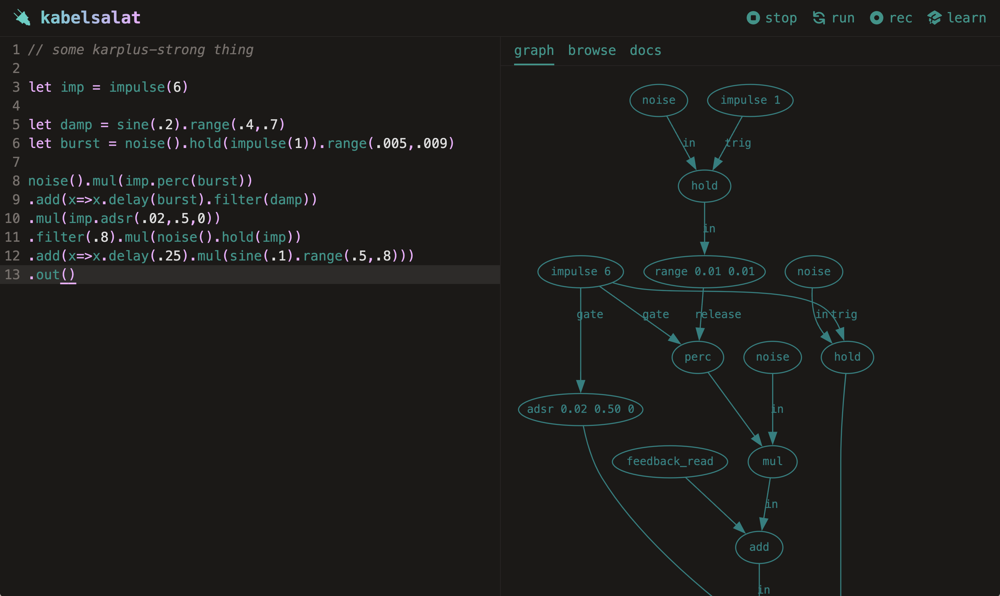
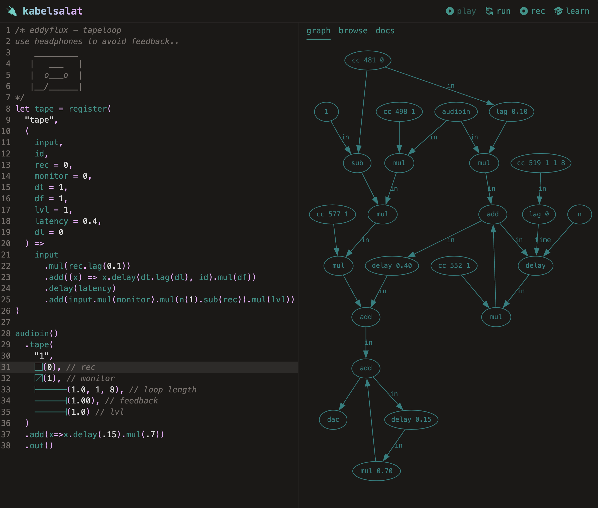

---
# This template is licensed under a Creative Commons 0 1.0 Universal License (CC0 1.0). Public Domain Dedication.

title: 'KabelSalat: Live Coding Audio-Visual Graphs on the Web and Beyond'
author:
  - name: Felix Roos
    affiliation: Unaffiliated
    email: flix91@gmail.com
  - name: Raphaël Maurice Forment
    affiliation: Université Jean Monnet
    email: raphael.forment@gmail.com
abstract: |
  This paper introduces KabelSalat, a graph-based live coding environment that targets multiple platforms and languages. It works by translating a Domain Specific Language (DSL) based on JavaScript into a signal flow graph. This graph can be compiled into a sequence of instructions optimized for real time signal processing. The DSL has been implemented both in JavaScript and Lua. The compiler can either output JavaScript code to run in the browser or optimized C code to run natively. The possibility of adding other target languages is an integral part of KabelSalat's design. The browser version includes a REPL and features a range of audio DSP nodes reminiscent of modular synthesizers. Notable features include single sample feedback and multi-channel expansion inspired by the SuperCollider audio engine. The core module of KabelSalat has also been used to implement a stripped down version of the Hydra video synthesizer, thus demonstrating that the same underlying principles can be adapted both for audio and video generation. In the future, KabelSalat might become an alternative audio engine for Strudel, offering more sound design capabilities, compared to the current superdough engine, which uses the browser's built-in Web Audio Nodes.
fontsize: 11pt
geometry: margin=2cm
fontfamily: libertine
fontfamily: inconsolata
mainfont: Linux Libertine
monofont: Inconsolata
bibliography: references.bib
header-includes:
    - \usepackage{svg}

...


Figure 1: KabelSalat web interface ([https://kabel.salat.dev](https://kabel.salat.dev), accessed on September 27, 2024) running a Karplus Strong patch. On the left pane pane: source code editor. On the right pane: audio graph visualizer.
\pagebreak

# Introduction

Graphs are often used to represent the signal flow of live coding systems, as demonstrated by Glicol [@glicol],
Genish.js [@Roberts17], Hydra [@hydra] or Punctual [@punctual].
Using graph-based data structures, logic and/or user interfaces is a common paradigm for all creative software that preferably direct information and data according to this metaphor, encompassing both audio and image/video applications.
The same reason explains the popularity of this paradigm in live patching environments such as NoiseCraft [@noisecraft], cables.gl [@cables] or VCVRack. Graphs are sometimes perceived as more natural to the end user. They allow a direct and intuitive representation of the signal flow, sometimes emulating the patching of pedalboards or modular synthesizers.
Many important audio programming languages from the past decades, such as Pure Data [@puredata] and SuperCollider [@supercollider] are also computing audio based on the concept of signal flow graphs. In this specific case, the reason for using graphs is quite different. Graphs often allow for an optimized execution of the signal processing chain, as they can be analyzed and optimized before execution.

<!--
old main before 27-sept
Nowadays, this dataflow paradigm is getting increasingly more common in the context of web audio. One can notice a gradual shift from the usage of built-in Web Audio nodes^[] to the more recently introduced AudioWorklets [@Choi2018AudioworkletTF;@Roberts18]. AudioWorklets allow the creation of self-contained signal processors, less dependant on web platform specifics. These can be developed in JavaScript and/or compiled to WebAssembly from any other language supporting this compilation target. Furthermore, they introduce a significant advantage over built-in web audio nodes. Audioworklets can be used to implement DSP algorithms that rely on single-sample processing. This property offers many advantages over block-based processing such as the possibility of writing audio feedback loops or granular synthesis algorithms [@Roberts17]. -->

Digital signal processing in web browsers has historically adopted a graph based approach, as demonstrated by the Web Audio API^[The _Mozilla Developer Network_ website provides a thorough introduction to the Web Audio API: [https://developer.mozilla.org/en-US/docs/Web/API/Web_Audio_API/Using_Web_Audio_API](https://developer.mozilla.org/en-US/docs/Web/API/Web_Audio_API/Using_Web_Audio_API) (accessed on September 27, 2024). This API can be considered as the basic building blocks for more complex applications and libraries such as ToneJS [@tonejs].]. This _dataflow paradigm_ continues to gain in popularity in the context of Web Audio. The Web Audio API is based on a classic block-based processing model [@cmtutorial] and relies on a set of predefined audio nodes comparable to UGens in computer music programming languages. These nodes are designed for lightweight multimedia applications rather than specialized audio and signal processing (_e.g._ basic audio filters, equalization, panning) where time and CPU usage are a critical resource. For the creative musicians, such nodes can be limiting, as they do not allow for the creation of complex audio graphs or the implementation of optimized and lightweight specialized audio algorithms. The introduction of AudioWorklets has recently opened up the possibility of single-sample processing in the browser [@Choi2018AudioworkletTF]. They also offer a way for developers to build bespoke audio nodes.
AudioWorklets are offering significant advantages over block-based processing. Single-sample processing removes the block size constraint of classic Web Audio nodes, which is often felt as both a technical and creative limitation. Computing audio in blocks can prevent or hinder the implementation of various classic algorithms: filter design, physical modeling, etc. Consequently, this can have an incidence on the sonic palette available to the musician. Despite their recent introduction, AudioWorklets have already proven their value in the implementation of audio feedback loops, granular synthesis algorithms [@Roberts17;@Roberts18] or physical modeling (ADD EXAMPLE). AudioWorklets are offering yet another advantage: they are self-contained signal processors that do not depend on web platform specifics. They be developed in JavaScript and/or compiled to WebAssembly from any other language supporting this compilation target.

We began exploring the new avenues introduced by AudioWorklets because of technical and creative constraints felt during the development of Strudel [@strudel]. Strudel audio engine, _SuperDough_^[Link to _SuperDough_ on the _npm_ package manager: [https://www.npmjs.com/package/superdough](https://www.npmjs.com/package/superdough) (accessed on September 27, 2024).], is built using the aforementioned Web Audio API. It is built in imitation to _SuperDirt_, the classic Tidal Cycles audio engine, that relies on the extensive capabilities of the SuperCollider audio server^[Link to the _SuperDit_ repository on GitHub: [https://github.com/musikinformatik/SuperDirt](https://github.com/musikinformatik/SuperDirt) (_idem_).]. In order to provide users with a similar level of flexibility and expressiveness in audio design, we needed to find a way to implement high-performance custom audio nodes in the browser. Our long-term goal is to be able to replace Strudel's current audio engine, called _SuperDough_, by a custom and flexible solution based on AudioWorklets. For the time being, Strudel still uses the more limited set of features provided by the Web Audio API nodes.

# Introducing the KabelSalat DSL

KabelSalat implements a Domain Specific Language (DSL) to represent and compile graphs suitable for single-sample processing. It can be used both a prototyping bench for audio algorithms or as a DSP-oriented live coding language. The KabelSalat compiler and runtime is designed, above all things, to be embedded in other applications. However, it can also be used as a standalone application through an Integrated Development Environment (see Figure 1). The compilation strategy -- as well as many fundamental audio nodes -- are based on the browser-based NoiseCraft synthesizer [@noisecraft]. KabelSalat's development started via an attempt to rewrite NoiseCraft's compiler to a version that encapsulates its core logic from the output language, allowing each node to control its own code generation (UNCLEAR, ADD FOOTNOTE). With this crucial addition, the core language is not specifically tied to a specific audio graph format or to a single target language. To test the viability of this design, we have developed a way for KabelSalat patches to be compiled to C code and played as standalone binaries. As another proof-of-concept, KabelSalat was used to compile Hydra patches to GLSL code [@hydra], showing an application of the same concepts in another neighbouring domain.

\newpage

<!-- # System Overview

```
User -> DSL -> Graph -> Compiler -> Code+Metadata -> Runtime
```
 -->

## First example: a substractive synthesizer patch

KabelSalat is based on a terse and practical syntax that relies heavily on method chaining. This can be seen as a way to emulate the patch point connexions between the different modules of a synthesizer. Functions and methods can be considered as signal generators or processors (nodes), which can be connected and/or combined to other modules through chaining or reference. Arguments of these nodes can either be constant values or other nodes^[]. The same basic principles can be used for creating patches of arbitrary depth and complexity. Figure 2 and 3 provide an example of how a classic subtractive synthesizer patch can be written in KabelSalat, and how a visual trace of the audio graph can be generated in real time.

\vspace{0.5em}
\setcounter{figure}{1}    
\begin{figure}[h!]
    \centering
    \begin{minipage}{0.40\textwidth}
        \begin{Shaded}
        \begin{Highlighting}[]
        \CommentTok{// sawtooth wave at 55Hz:}
        \FunctionTok{saw}\NormalTok{(}\DecValTok{55}\NormalTok{)}
          \CommentTok{// modulated low{-}pass{-}filter}
          \OperatorTok{.}\FunctionTok{lpf}\NormalTok{(}\FunctionTok{sine}\NormalTok{(}\DecValTok{1}\NormalTok{)}\OperatorTok{.}\FunctionTok{range}\NormalTok{(}\FloatTok{0.4}\OperatorTok{,} \FloatTok{0.8}\NormalTok{))}
          \CommentTok{// modulated amplitude:}
          \OperatorTok{.}\FunctionTok{mul}\NormalTok{(}\FunctionTok{sine}\NormalTok{(}\DecValTok{4}\NormalTok{)}\OperatorTok{.}\FunctionTok{range}\NormalTok{(}\FloatTok{0.25}\OperatorTok{,} \DecValTok{1}\NormalTok{))}
          \CommentTok{// send to audio output:}
          \OperatorTok{.}\FunctionTok{out}\NormalTok{()}\OperatorTok{;}
        \end{Highlighting}
        \end{Shaded}
        \caption{A low-pass filtered sawtooth oscillator with a final stage of amplitude modulation.}
    \end{minipage}\hspace{0.1\textwidth}
    \begin{minipage}{0.40\textwidth}
        \centering
        \pandocbounded{\includegraphics[keepaspectratio]{images/figure1.png}}
        \vspace{4.2em}
        \caption{Visual representation of the same audio graph, generated in real-time using GraphViz.}
    \end{minipage}
\end{figure}

## Method Chaining

The previous example implicitely demonstrates how KabelSalat _flattens_ the syntax in order to make the code more readable to the end-user. Figure 4 reproduces the same patch, using only function calls. Even though the code appears syntactically simpler, it becomes more difficult to parse and manipulate for musicians in the context of a live coding session. Method chaining cna be seen as a way to alleviate this issue. Similar to Hydra [@hydra] and Strudel [@strudel]^[Strudel used the same technique applied to a different domain: the functional composition of musical patterns. Hydra uses it, similarly to KabelSalat, as a way to connect and combine video processing nodes.], it has been designed to work in a similar fashion to infix notation, without the need to overload operators. When a method is called on a node, that node is used as the first input of the method. Method chaining provides a visual linearity that is often advantegeous for parsing and editing code representing signal flows.


```js
// send to output:
out(
  // modulate amplitude
  mul(
    // modulated low-pass-filter
    lpf(
      // sawtooth wave at 55Hz:
      saw(55),
      range(sine(1), 0.4, 0.8)
    ),
    range(sine(2), 0.25, 1)
  )
);
```
Figure 4: The same substractive patch, without using method chaining. Compared to the method chaining example, the expression is deeply nested, with a wider distance between logically grouped tokens. Additionally, editing the expression involves a lot of extra indenting and cursor movement.

<!-- This notation only consists of function calls, which is syntactically simpler, but arguably more difficult to parse as a human. Compared to the method chaining example, the expression is deeply nested, with a wider distance between logically grouped tokens.
It is more difficult to find the start of the signal flow, because it starts somewhere in the middle rather then at the top-left.
Additionally, editing the expression involves a lot of extra indenting and cursor movement. -->

\newpage
## Multichannel Expansion

KabelSalat borrows the concept of multichannel expansion from SuperCollider^[This feature is documented in the official SuperCollider documentation: [https://doc.sccode.org/Guides/Multichannel-Expansion.html](https://doc.sccode.org/Guides/Multichannel-Expansion.html) (accessed on September 28, 2024).], allowing the duplication of a node or a chain of nodes to multiple channels. Large audio graphs involving parallel processing can thus be generated with relatively few characters. Multichannel expansion is based on providing function/method arguments as Arrays (_e.g._ `[1, 2, 3, 4]`, see Figure 4 and 5).

\vspace{0.5em}
\setcounter{figure}{3}    
\begin{figure}[h!]
    \centering
    \begin{minipage}{0.40\textwidth}
        \begin{Shaded}
        \begin{Highlighting}[]
        \CommentTok{// creating two channels of}
        \CommentTok{// filtered sawtooth waves}
        \FunctionTok{saw}\NormalTok{([}\DecValTok{200}\OperatorTok{,} \DecValTok{300}\NormalTok{])}\OperatorTok{.}\FunctionTok{lpf}\NormalTok{(}\FloatTok{0.5}\NormalTok{)}\OperatorTok{.}\FunctionTok{out}\NormalTok{([}\DecValTok{0}\OperatorTok{,} \DecValTok{1}\NormalTok{])}\OperatorTok{;}
        \end{Highlighting}
        \end{Shaded}
        \caption{Multichanel expansion on two channels using Arrays (\texttt{[200, 300]} and \texttt{[0, 1]}).}
    \end{minipage}\hspace{0.1\textwidth}
    \begin{minipage}{0.40\textwidth}
        \centering
        \begin{Shaded}
        \begin{Highlighting}[]
        \CommentTok{// the above is equivalent to:}
        \FunctionTok{saw}\NormalTok{(}\DecValTok{200}\NormalTok{)}\OperatorTok{.}\FunctionTok{lpf}\NormalTok{(}\FloatTok{0.5}\NormalTok{)}\OperatorTok{.}\FunctionTok{out}\NormalTok{(}\DecValTok{0}\NormalTok{)}\OperatorTok{;}
        \FunctionTok{saw}\NormalTok{(}\DecValTok{300}\NormalTok{)}\OperatorTok{.}\FunctionTok{lpf}\NormalTok{(}\FloatTok{0.5}\NormalTok{)}\OperatorTok{.}\FunctionTok{out}\NormalTok{(}\DecValTok{1}\NormalTok{)}\OperatorTok{;}
        \end{Highlighting}
        \end{Shaded}
        \caption{Equivalent code without channel expansion.}
    \end{minipage}
\end{figure}

Multichannel expansion in KabelSalat involves the use of a special `poly` node. Each element of the Array used for expansion is considered as an input. When a node receives a `poly` node with `n` inputs, `n` copies of the node are created. Each copy receives one of the values in the Array. The copied nodes are fed into a new `poly` node, which is propagated down the graph. The `poly` node will eventually end up at the bottom of the graph, where each channel is assigned to one `out` node. In cases where a node receives multiple `poly` nodes, the `poly` node with the most inputs determines the number of copies. The inputs of the other `poly` nodes wrap around. Figure 6 shows a graphical version of how the `poly` node is propagated in the above example.


Figure 6: compilation stages of the `poly` node used in Figure 4.

ADD SOMETHING ABOUT THE INTEREST OF MULTICHANNEL EXPANSION FOR USERS / MUSICIANS

## Feedback

KabelSalat supports the creation of audio graphs involving feedback loops. A feedback loop is created when a node uses its own output as an input.
Feedback plays an important role both for audio and video synthesis [@Roberts17]. 

### Feedback loop using anynomous functions

An anonymous function can be passed to any node to create a cycle:

```js
impulse(1)
  .add((x) => x.delay(0.2).mul(0.8))
  .out();
```

In this example, the `add` node receives an anonymous function as its input, which receives its own output as an argument. This allows notating the transformsations of the feedback loop within that function. Figure 3 shows a graph visualization of this example.


### Feedback loop using the source (`src`) Node

Instead of using an anonymous function, feedback can also be created with the dedicated `src` node:

```js
impulse(1).add(src(0).delay(0.1).mul(0.8)).out();
```

This syntax is inspired by Hydra [@hydra], where feedback is also created using `src` and `out` nodes.

# Audio Graph Compilation

KabelSalat audio graphs are compiled into a representation optimized to run with good performances in the constraints of a real-time system. For the sake of demonstration, we are going to focus on the JavaScript output, but the same principles apply to the C or the GLSL targets.

## First step: from DSL to Graph

When a KabelSalat script is evaluated, the DSL is parsed into a directed graph.

When the DSL is evaluated, a directed graph is created. As a TypeScript interface, the structure of a `Node` can be described as:

```ts
interface Node {
  type: string;
  ins: Array<Node | number>;
}
```

Each `Node` has a type and an Array of inputs called `ins`.
Elements inside `ins` are either other instances of `Node` or constant numeric values.
Here is an example of a `Node` instance representing a filtered sawtooth wave:

```json
{
  "type": "out",
  "ins": [{ "type": "lpf", "ins": [{ "type": "saw", "ins": [200] }, 0.5] }, 0]
}
```

Note that the above data is represented as json only for the purpose of readability. The actual implementation uses JavaScript Objects, where each `Node` is only referenced, meaning reused `Node` instances will not be copied. For cyclical graphs, a JSON representation does not exist, because it would create an infinite loop.

## Second step: from Graph to Output Language

To generate efficient runtime code, the graph is converted into a sequence of steps.
Before compilation, `Nodes` are sorted topologically, making sure each `Node`'s inputs are computed first.
The compiler output for the graph of the last example is as follows:

```js
r[1] = nodes[0].update(200); /* saw */
r[3] = nodes[1].update(r[1], 0.5, 0); /* lpf */
o[0] = r[3]; /* out 0 */
```

In an AudioWorklet [@Choi2018AudioworkletTF], this code will run once for each sample, typically at 44,1kHz or 48kHz. Each `Node` corresponds to one line in the generated code. It expects the following variables to be defined:

- `nodes`: instances of stateful nodes
- `r`: node value registers
- `o`: output channel registers

### Stateful Nodes

The `nodes` Array contains instances of stateful signal processors, which are expected to be provided to the compiled function.
Stateful nodes are essential for many audio DSP techniques, for example to keep track of the phase of an oscillator while its frequency is being modulated. Each audio processor needs to implement an `update` method to compute the next sample based on its input arguments.
A simple sawtooth wave can be implemented in JavaScript as follows:

```js
class SawOsc {
  constructor() {
    this.phase = 0;
  }
  update(freq) {
    this.phase += SAMPLE_TIME * freq;
    return (this.phase % 1) * 2 - 1;
  }
}
```

In the C language, a similar pattern can be implemented with an update function operating on a struct.
In GLSL, nodes are stateless due to the parallel nature of graphics rendering.

### Value Registers

The `r` Array contains the latest output values of each `Node`.
When a graph contains cycles, the node that receives the feedback depends on a node that has not been calculated yet.
By saving each `Node`'s result into the `r` Array, those nodes will automatically receive the value from the previous iteration.
To illustrate this point, here is the compiled output of Figure 3:

```js
r[1] = nodes[0].update(1); /* impulse */
r[3] = nodes[1].update(r[6], 0.2); /* delay */
r[5] = r[3] * 0.8; /* mul */
r[6] = r[1] + r[5]; /* add */
o[1] = r[6]; /* out 1 */
o[0] = r[6]; /* out 0 */
```

In Line 2, `r[6]` references the value of the previous iteration, making feedback possible.

### Output Registers

The `o` Array keeps track of each output channel.
After each iteration of the compiled sequence, `o[0]` and `o[1]` can be passed to the sound card for playback.
The `out` function of the DSL takes a channel as its only argument, which falls back to `[0,1]`.
This ensures both stereo channels receive a value by default.

## Node Compilation

To encapsulate the compiler logic from the output language, each node definition contains a `compile` function that is expected to output its target language. The compiler's sole responsibility is to pass the correct register names and constant values to the compile function. An `impulse` node could be defined to output C code as:

```js
let saw = registerNode("impulse", {
  ugen: "ImpulseOsc",
  compile: ({ vars: [freq = 0], name, node, ugen }) =>
    `${name} = ${ugen}_update(${node},${freq}); /* ${ugen} */`,
});
```

In comparison to the JavaScript version, the C version of Figure 3 is:

```c
r[1] = ImpulseOsc_update(nodes[0],1); /* ImpulseOsc */
r[3] = Delay_update(nodes[1],r[6],0.2); /* Delay */
r[5] = r[3] * 0.8;
r[6] = r[1] + r[5];
o[0] = r[6]; /* out 0 */
o[1] = r[6]; /* out 1 */
```

# Runtime

The purpose of the runtime is to create an environment for the compiled code to be executed in. It also handles code updates, which are essential for a live coding system. The Web Audio runtime of KabelSalat is located in an AudioWorklet that communicates with the rest of the application via a MessagePort [@Roberts18]. After a graph is compiled, its code, along with some metadata is sent to the worklet. Inside the worklet, a `Unit` is spawned, which contains a unit generator for each stateful node.
The main processing loop of the AudioWorklet sums all spawned `Unit`'s to calculate the final mix. When the code is updated, a new `Unit` is spawned and a crossfade between the old and new `Unit` is performed. This avoids cracks in the audio due to sudden amplitude jumps. Similar to SuperCollider, KabelSalat allows to adjust the fade time of the crossfade.

In the GLSL version, fades are not necessary, as the worst case in the visual domain is a flash from a light to a dark color.
Instead, a new shader program is created and swapped with the old one when the code is updated. At the time of this writing, the runtime of the C version only supports running a single graph without the ability to update, which is not yet enough for live coding.

## Real Time Input

To handle real-time input, the Web Audio version of KabelSalat supports Audio and MIDI input, as well as the ability to change values without recompilation. These inputs allow direct interaction with the code through a microphone, MIDI controller or in-source UI elements.



# Future Outlook

In the future, further steps will be taken in the direction of becoming an event based audio engine.
So far, it is not possible to schedule sample accurate events from the outside, which is a requirement of Strudel's audio engine.
Additionally, Tidal patterns [@tidal] might be combined with an audio graph in a different way, by using Patterns as inputs for individual nodes, rather than composing entire expression to a single pattern.
In the current version, nodes are not reused from Unit to Unit, meaning the node state will reset on each update. This leads to sequences being reset as well, which is often undesirable. Finding nodes that can be kept across evaluations would be possible by employing a diffing algorithm between the old and the new graph.
Furthermore, the handling of Unit's could be extended to allow evaluating graphs in a block based fashion, where multiple Unit's can coexist in parallel.
On the web, potential performance gains could be achieved by compiling to WebAssembly instead of JavaScript [@Roberts22].

# REPL

KabelSalat's website^[Website link: [https://kabel.salat.dev/](https://kabel.salat.dev/) (accessed on September 27, 2024). ] hosts the latest version of the Web Audio compiler of KabelSalat.
It can be used as a way to experiment, share patches and live code without any audio interruption.
It consists of a code editor (1), a graph visualizer (2), example patches (3) and an interactive documentation (4).
Similar to the Strudel REPL [@strudel], the code editor supports in-source UI elements, such as buttons and sliders.
The URL always reflects the latest code change, allowing patches to be shared as a hyperlink.

# License

All code is open source under the AGPL-3.0 License [-@gnuafferogeneral].
Contributions are welcome and can be made through the GitHub repository^[GitHub repository link: [https://github.com/felixroos/KabelSalat](https://github.com/felixroos/KabelSalat) (_idem_).].

# Acknowledgements

Thanks to the Strudel and wider Tidal, live coding, WebAudio and free/open source software communities for inspiration and support.
Special thanks to the early adopters pulu and Raphaël Forment for valuable feedback and contributions.

\newpage

# References
